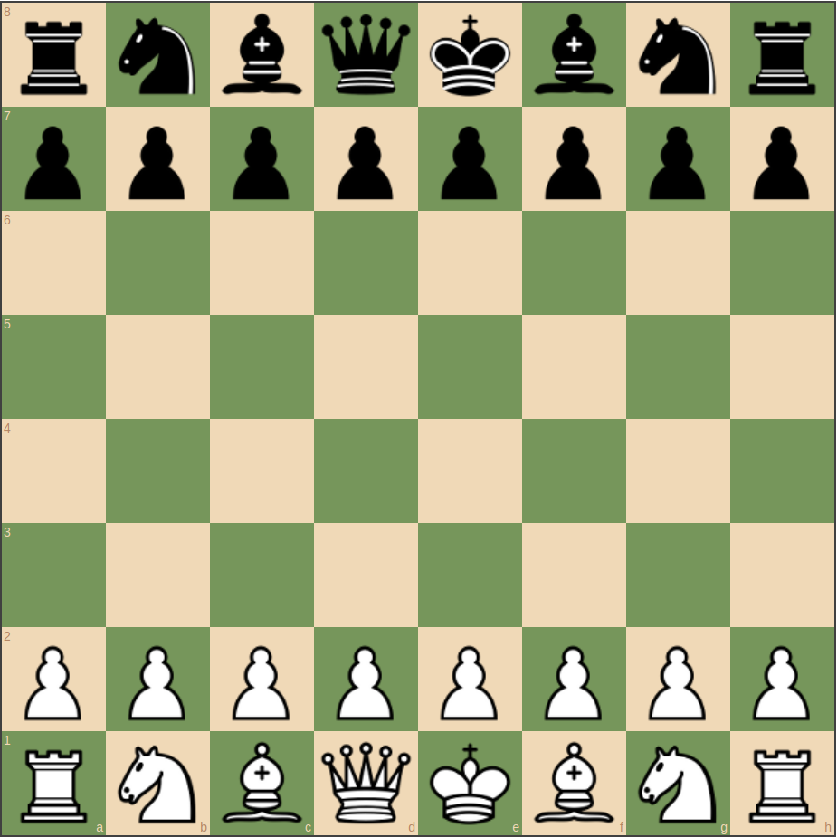
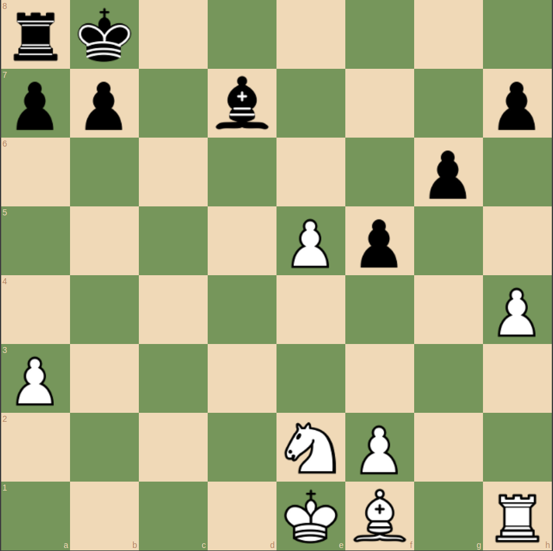

# AI Chess Game - JavaScript
A simple and complete GUI version AI based Chess Game.
 

### Languages & tools :
[][link]
[][link]
  

| Screenshot 1 | Screenshot 2|
|------|------|
|||

### Directory Structure :
    AI_ChessGame-JavaScript
        |-- index.html
        |-- style.css
        |-- script.js
        |-- lib
        |   |-- chessboardjs
        |   |   |-- css
        |   |   |   |-- chessboard-0.3.0.css
        |   |   |   |-- chessboard-0.3.0.min.css
        |   |   |-- js
        |   |       |-- chess.js
        |   |       |-- chessboard-0.3.0.js
        |   |       |-- chessboard-0.3.0.min.js
        |   |-- jquery
        |   |   |-- jquery-3.2.1.min.js
        |   |
        |   |-- js
        |       |-- chess.js
        |          
        |-- QuizGame-Java.iml
        |-- quiz_data.json
        |
        |-- img
        |   |-- chesspieces
        |   |   |-- wikipedia
        |   |       |--bB.png
        |   |       |--bK.png
        |   |       |--bN.png
        |   |       |--bP.png
        |   |       |--bQ.png
        |   |       |--bR.png
        |   |       |--wB.png
        |   |       |--wK.png
        |   |       |--wN.png
        |   |       |--wP.png
        |   |       |--wQ.png
        |   |       |--wR.png
        |   |-- vscode.png
        |   |-- javascript.svg
        |   |-- chess1.png
        |   |-- chess2.png
        |
        |-- README.md

## Connect with me:  

  
 

[link]: https://github.com/AbhilashTUofficial/JavaScript-programming 

